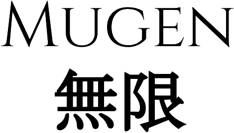

Mugen
===

## Notice
> :soon: WIP

## Status


[](https://github.com/unlimitedsoftwareworks/mugen)


[](https://mugen.praisethemoon.org)
[](https://twitter.com/alonnesora)

[](LICENSE)
[]()

[](https://codeclimate.com/github/unlimitedsoftwareworks/mugen)
[](https://codeclimate.com/github/unlimitedsoftwareworks/mugen/coverage)
[](https://codeclimate.com/github/unlimitedsoftwareworks/mugen)

|Compiler|Windows|Linux|OSX|FreeBSD|Haiku|Minix3|
|:---:|:---:|:---:|:---:|:---:|:---:|:---:|
|VC 2015 & 2013|[](https://ci.appveyor.com/project/praisethemoon/mugen)|`N/A`|`N/A`|`N/A`|`N/A`|`N/A`|
|MinGW|[](https://ci.appveyor.com/project/praisethemoon/mugen-i8kut)|`N/A`|`N/A`|`N/A`|`N/A`|`N/A`|
|GCC |`N/A`|[](https://travis-ci.org/unlimitedsoftwareworks/mugen)|[](https://travis-ci.org/unlimitedsoftwareworks/mugen)|`N/A`|`N/A`|`N/A`|
|Clang|[](https://ci.appveyor.com/project/praisethemoon/mugen-nh3aw)|[](https://travis-ci.org/unlimitedsoftwareworks/mugen)|[](https://travis-ci.org/unlimitedsoftwareworks/mugen)|`N/A`|`N/A`|`N/A`|

## About

Mugen is a multi-paradigm high level programming language designed to build robust and scalable applications. The language makes it easier for developers to write safe and maintable code while still maintaining a very good performance. Mugen is not only a language but a complete toolchain that provides dependencies manager, lua based makefiles, post-compilation processing (running unit tests, report generation, etc).

- Object Oriented
- Interface based type inference
- Functional
- Generic
- Concurrent
- Operator Overloading
- Function Overloading
- Static Typing
- Easy FFI (can easily communicate with C)
- Lua based build scripts
- Easily Import precompiled libraries (similar to Java's Jars)

```mu
/*
 * A Hello, World
 */

import(
	mugen.std.io.Console
)

function main(args: String[]) -> UInt32 {
	Console.println("Hello, World!")
	return 0
}
```
## Building

This repository is self contained. All you need is CMake as long as GCC, Clang or Visual Studio installed.
:arrow_right: Make sure to check the status on the top of the README as well to see if the code works on your platform/compiler before you build.
To build the project:
##### Linux & OSX:
```
mkdir build
cd build
cmake ..
make
```

##### Windows (VC):
```
mkdir build
cd build
cmake -G"Visual Studio 14 2015" ..
make
```

##### Windows (Clang):
```
mkdir build
cd build
cmake -G"Visual Studio 14 2015" -T"LLVM-vs2014" ..
make
```

## TODO
- [x] Lexer
- [x] Parser
- [x] AST
- [ ] Semantic Analysis
- [ ] Code Generation

## 3rd Party Tools

|Library|Purpose|
|:---|:---|
|https://github.com/unlimitedsoftwareworks/PDFGen| PDF report generation |
|https://github.com/unlimitedsoftwareworks/microtar| Library compression/decompression |
|https://github.com/unlimitedsoftwareworks/tinycthread|Concurrency|
|https://github.com/unlimitedsoftwareworks/smallprofiler|Profiling|
|https://github.com/unlimitedsoftwareworks/utf8.h|UTF-8 Encoding|
|https://github.com/unlimitedsoftwareworks/vec|Vector container|
|https://github.com/unlimitedsoftwareworks/map|Map Container|
|https://github.com/unlimitedsoftwareworks/dmt|Dynamic Memory Tracker|
|https://github.com/unlimitedsoftwareworks/lua|Creating build scripts/makefiles|

## License
See `LICENSE` for more license information.